# Bot Setup

The bot has two public slash commands:

- `/premint` - If the user registered on PREMINT and connected their Discord, they can verify if they are on the list. This command will also add a role to a user if they are in the list.
- `/premint <ETH wallet address or ENS name>` - If the user did not connect their Discord, they can still check if they are on the list by passing their ETH address or ENS name to the bot as the first argument.

_NOTE: If the user did not connect their Discord, they will not automatically get the role._

## Invite the bot

The first step is to invite the bot to your server:

https://discord.com/oauth2/authorize?client_id=950933570564800552&permissions=268438552&scope=bot+applications.commands

Once you've invited the bot, you'll see a new #premint-config channel.

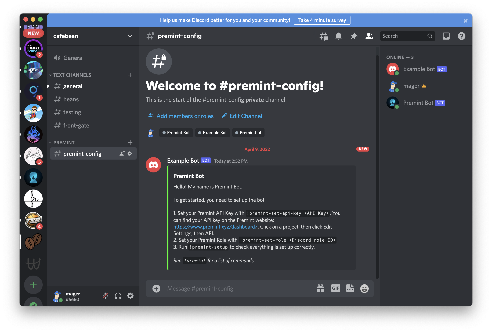

Here, you can use admin commands to interact with the bot.

## Set up your role & API key

The bot allows you to associate a role with a user if they are registered on PREMINT. We also need to add the PREMINT API key so we can make API calls to PREMINT from Discord.

### `!premint-set-role`

Let's create a role that your users will get when they run the `/premint` command.

In Discord, click `Server Settings`, then `Roles`, then `Create Role`. Add a name & color for your role.​

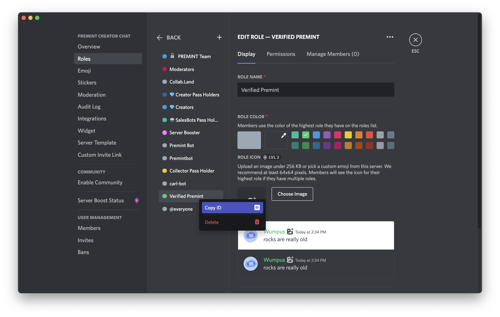
​
Click Save Changes and then right-click your new role to copy the role ID.

To set the role ID, in the `#premint-config channel`, type this command:

> `!premint-set-role DISCORD_ROLE_ID`

For example:

> `!premint-set-role 955243562814021672`

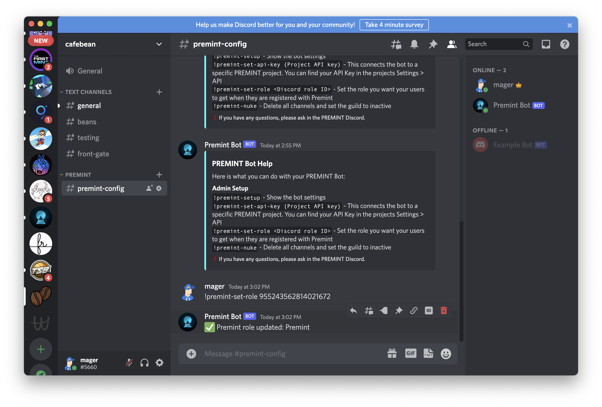

### `!premint-set-api-key`

You can find your API key on the PREMINT website: [https://www.premint.xyz/dashboard/](https://www.premint.xyz/dashboard/). Click on a project, then click `Edit Settings`, then `API`:
​
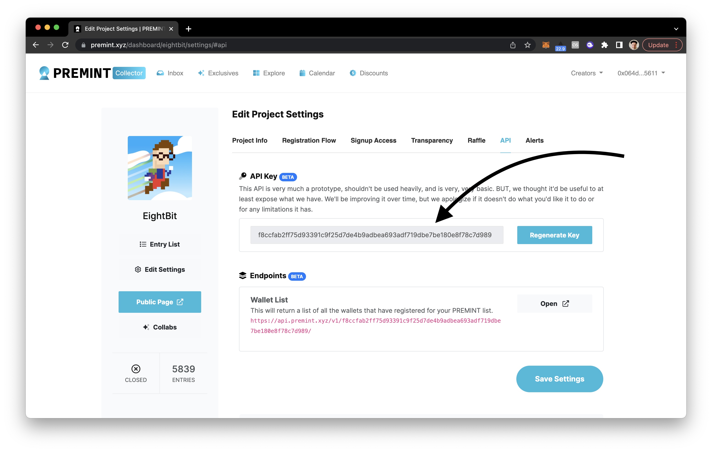
​
> `!premint-set-api-key PREMINT_API_KEY`

For example:

> `!premint-set-api-key f8ccfab2ff75d9339182983df719dbe7be180e8f78c7d989`
​
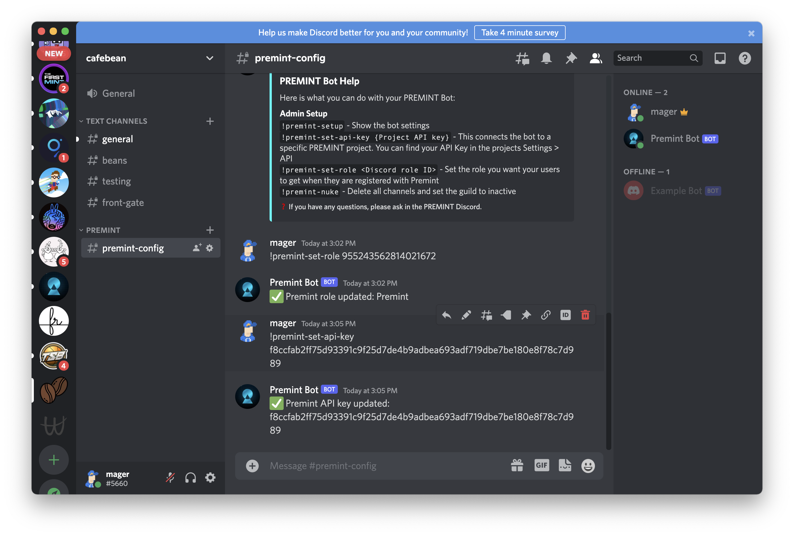

### `!premint-setup`

Once you've finished setting up your role & API key, you can type `!premint-setup` to verify that you're finished setting up the bot.

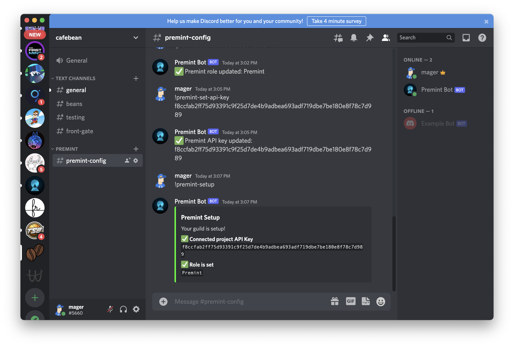

## Interacting with the bot

### `!premint`

You can always type `!premint` to see a list of commands:

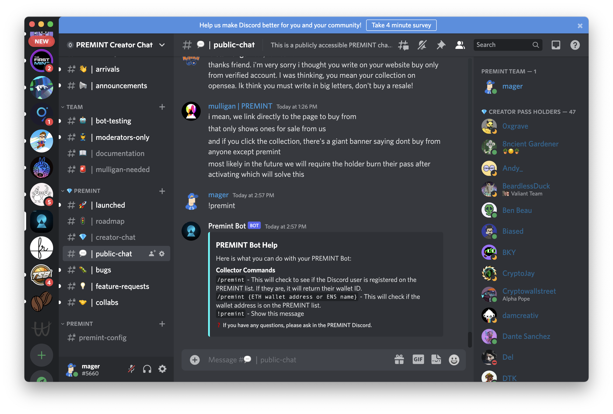
​
If you run this command in `#premint-config`, you'll see the admin commands:

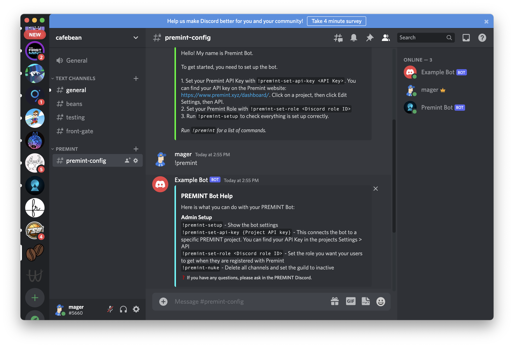
​​
### `/premint`

Users can type `/premint` in any channel to see if they are registered in the PREMINT list for your project.

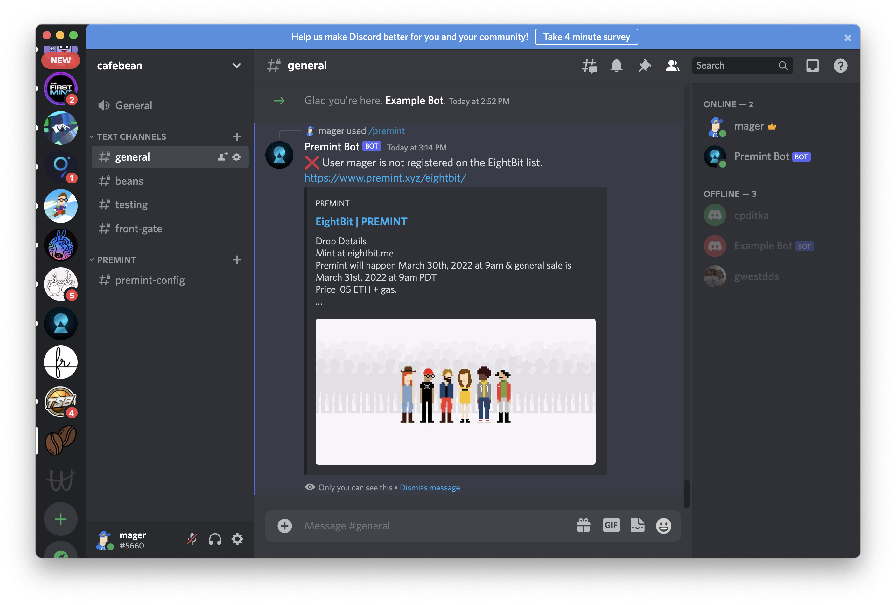
​
Since we're not passing in an address, we're relying on whether the user linked their Discord in PREMINT.

### `/premint <address>`

If a user did not link their Discord, we recommend they pass their ETH wallet address or ENS name to the bot.

For example:

> `/premint 0x064DcA21b1377D1655AC3CA3e95282D9494E5611`

Or:

> `/premint mager.eth`

This command will add the role you setup earlier to the user.
​
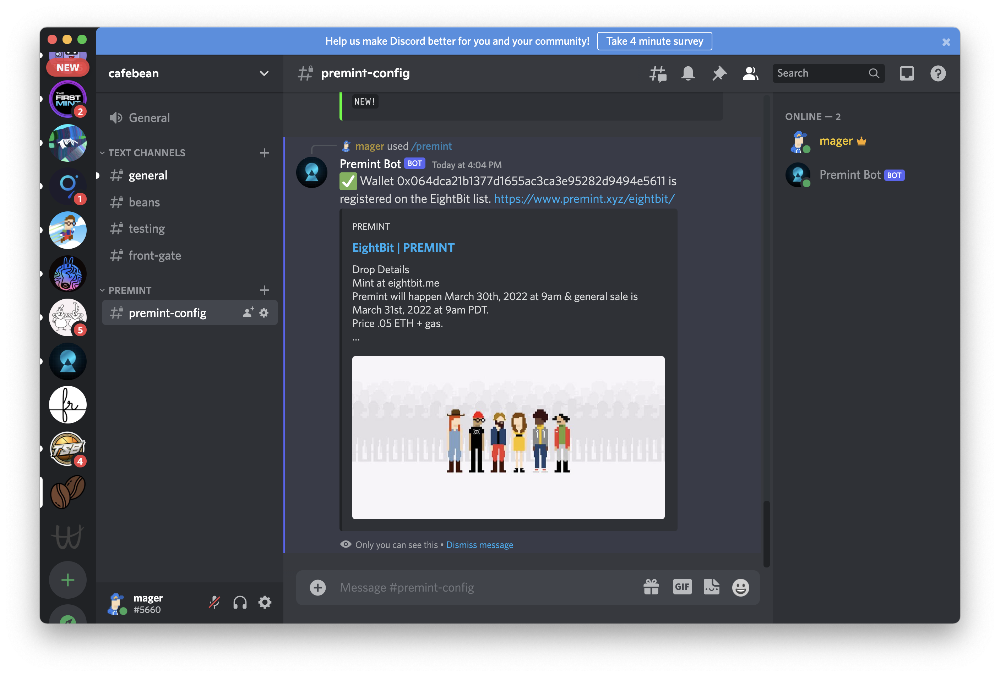

## Troubleshooting

Here are a few common errors/issues you'll run into, and how to solve them.

### The application did not respond

Discord bots have a 3 second timeout, and sometimes the PREMINT API may be experiencing latency. Try again later if this happens.
​

## Support

Please create a ticket in the `#support-ticket` channel in the PREMINT Discord.

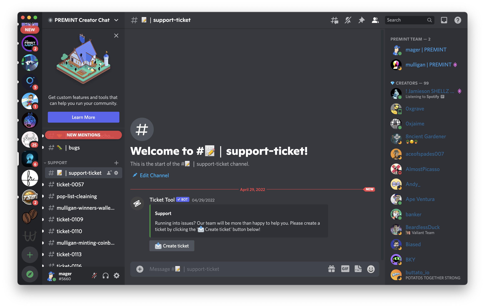

Reach out to `@mager` or `@mulligan` if you have any issues or questions!